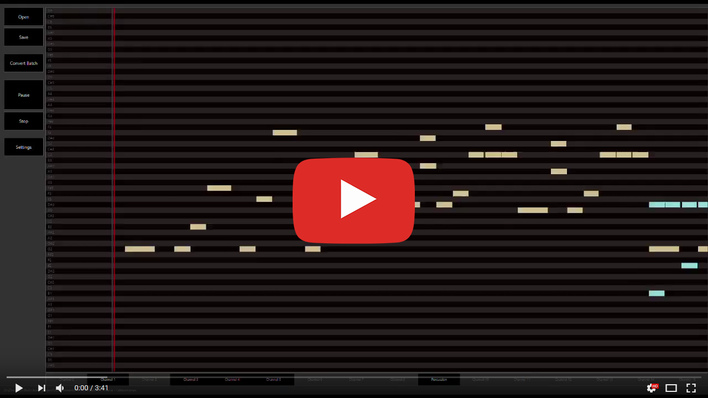

# Artificial Composition of Multi-Instrumental Polyphonic Music

We have tried to create a **generative model capable of composing polyphonic music**. Contrary to other work in the same field, our goal was to generate music with **multiple instruments** playing simultaneously to cover a broader musical space. 

We train three modules based on **LSTM neural networks** as the generative model; a lot of effort is put into reducing high complexity of multi-instrumental music representation by a thorough musical analysis.

[](https://www.youtube.com/watch?v=loztbOaOWn8&list=PLKptFqEtV0Vz_mThxehdBQPI7Xy5KTaLW)

&nbsp;
## Musical Analysis

We need to **reduce the complexity of input MIDI data** without significant compromises on the possible musical expression. Training a neural network without this reduction would be **impossible** for current state-of-the-art neural architectures because the space of raw MIDI files is too large. The analysis consists of three main procesures:

#### Meter detection
Capturing the rhythmic structure correctly is difficult, as the rhythm is dependent on time which is inherently continuous. To discretize the time with as low loss of information as possible, we have to **find the underlying metrical structure and normalize the tempo according to it**.

#### Key detection
When considering the most usual major and minor modes, there are 24 different keys in total. A single pitch has a different role in each of these keys, which adds a lot of complexity that a prediction model should learn. Hence, we **classify the keys** (using a random forest model) **and then transpose them** to a unified key.

#### Chord sequences detection
We use the harmonic structure as a representation of music at a higher abstract level (than simple notes) to **prolong the scope of the LSTM generative model**. Therefore we try to estimate the chord progressions with a help of the detected meter and key.

&nbsp;
## Generative Model

The generative model consists of three modules: Chord Predictor, Note Predictor and Volume Predictor. 


**Chord Predictor** is used to generate the underlying chords, one chord per beat. It is trained on data obtained from the chord detector. The most important module is **Note Predictor**, which generates events – either note-ons, note-offs or shifts in time. The Note Predictor accepts a chord obtained from the Chord Predictor and the last event to generate a new event. If the event constitutes a start of a new note, then the **Volume Predictor** is used to assign a volume to that note. Each module processes information in a sequential manner – it predicts a new state based on all of the previous states. Hence we use an LSTM network as the base of each module.


&nbsp;
## Conclusion

In order to evaluate the performance of the proposed model, we have conducted an **online survey**. The results show that there is still space for enhancement, but overall the artificial music was rated almost as good as the real music and was rather hard to distinguish (with **62.6% accuracy**).

We hope the thesis shows that it is indeed possible to let computers compose music. Although the output is not perfect and is limited to a symbolic representation, it can create listenable compositions that are hard to distinguish from human-made music. 


&nbsp;
## Overview of the Repository

The repository is divided into four different folders that are briefly described below. More details can be found in readme files contained in each of them.


#### Analyzer

GUI application used for analysis, conversion and visualization of .mid and internal .mus files. Please note that the GUI front-end is a side project, not an explicit part of the bachelor thesis, but it contains all algorithms described in Chapter 5 about music analysis. We use it for an easier and more intuitive evaluation of the algorithms.


#### Generative Model

Source files for the generative model implemented in PyTorch (deep learning library for python). It also contains already trained models that can be used to generate new music.


#### Samples

Sample files outputed from the models contained in the Generative Model folder. The folder contains both good and bad sounding examples that should illustrate the overall behaviour of the generative model.


#### Survey

Files related to the [online questionaire](http://dotaznik.neqindi.cz/index.php?lang=en). Contains the 104 audio files used in the questionaire and also a table with all answers from 293 users.

#### Thesis.pdf

Single-page version of the bachelor thesis.

&nbsp;
## BibTeX Citation

```
@thesis{SAMUEL18,
  author    = {David Samuel},
  title     = {Artificial Composition of Multi-Instrumental Polyphonic Music},
  year      = {2018},
  type      = {Bachelor's Thesis}
  publisher = {Univerzita Karlova, Matematicko-fyzik{\'a}ln{\'\i} fakulta}
  url       = {https://is.cuni.cz/webapps/zzp/detail/194043/},
}
```
